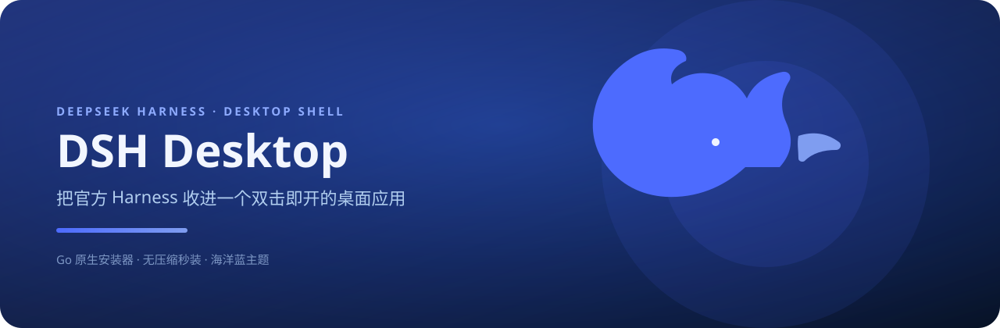
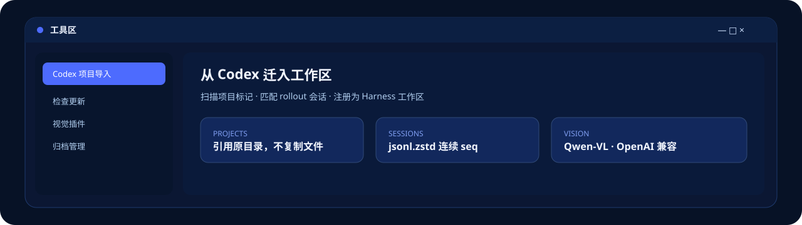
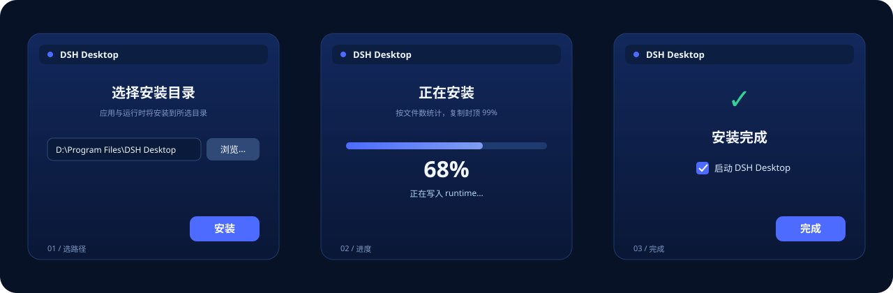
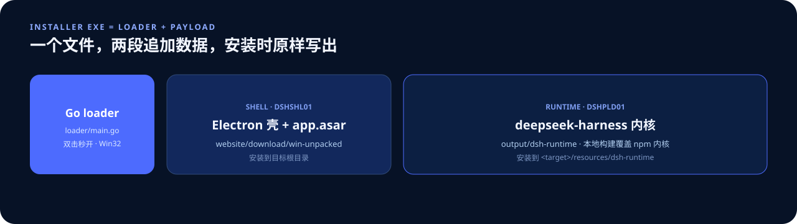

<p align="center">
  
</p>

<p align="center">
  <a href="https://ds.oykb.cn">官方下载</a>
  ·
  <a href="INSTALLER.md">安装器规范</a>
  ·
  <a href="https://github.com/oykb58246/dsh-desktop">GitHub</a>
  ·
  <a href="https://github.com/deepseek-ai/deepseek-harness">DeepSeek Harness</a>
</p>

**DSH Desktop** 是官方 [deepseek-harness](https://github.com/deepseek-ai/deepseek-harness) 的 Electron 桌面壳：双击安装、本地拉起 `dsh web`，把 Web 工作台收进独立窗口。作者 [oykb](https://github.com/oykb58246)，安装包在 [ds.oykb.cn](https://ds.oykb.cn)。

---

## 本地运行

```powershell
pnpm install
pnpm start
```

首次启动会自动检查 `deepseek-harness`：

- `node_modules` 缺失时安装工作区依赖
- Web / CLI 产物缺失时构建 harness
- 启动 `pnpm dsh web --host 127.0.0.1 --port 0`

随后 Electron 打开内嵌的 Web 应用。

---

## 它能做什么

<p align="center">
  
</p>

标题栏右侧窗口按钮（`- □ ×`）左侧的扳手打开独立工具窗口（`electron/tools.html`）。

| 工具 | 做什么 |
|------|--------|
| **Codex 项目导入** | 扫描 Codex 工作区，把项目注册进 Harness，并把勾选的会话写成 dsh 日志 |
| **检查更新** | 对照 `latest.yml`（GitHub Releases 兜底）下载安装包，安装器 worker 覆盖安装并重启 |
| **视觉插件** | 粘贴的图片经 Qwen-VL 转成文字再交给当前模型；也可用 `vision_chat` 追问 |
| **归档管理** | 工作区「删除」改为归档；工具区可一键恢复工作区或单条会话 |

主窗口与工具区都支持文本选区，以及右键复制 / 粘贴 / 剪切 / 全选。

---

## 安装器

安装器是 **Go 原生 Win32 程序**（`loader/main.go`）：双击秒开、数据不压缩，以追加字节封进 exe，安装时原样写出。界面跟 Electron 同一套海洋蓝。

<p align="center">
  
</p>

三步：**选路径 → 按文件数走进度 → 完成（默认勾选启动）**。

<p align="center">
  
</p>

打包唯一入口：

```powershell
pnpm dist:win
```

`prepare:runtime`（`scripts/prepare-runtime.mjs`）会先构建本地 `deepseek-harness` 源码，再下载 `upstream.lock.json` 锁定的 npm 内核作为依赖树，然后把本地构建产物（全部 `@deepseek-ai/dsh-*` 包的 `lib/` 与 Web 前端 `dist/`）覆盖到内核上。因此安装包内置的是**本仓库的 harness**（含视觉插件与模型设置改动），不是纯 npm 快照。

完整容器格式、UI 规范与踩坑见 [INSTALLER.md](INSTALLER.md)。不要改用 electron-builder 的 `portable` / `nsis`，也不要加压缩。

---

## 工具区细节

### Codex 项目导入

`electron/codex-import.mjs`

- 只读扫描用户选择的 Codex 工作区，识别项目标记（`package.json`、`Cargo.toml`、`pyproject.toml` 等），跳过 `node_modules` / `dist` / `target`
- 列出每个项目目录下匹配的 Codex 历史会话（`rollout-*.jsonl` + `session_index.jsonl`，双向路径归属匹配）
- 冲突预检：目标目录同名项目、已导入会话
- **不复制项目文件**：注册工作区引用原目录，并导入会话；同名不同目录的已导入项目可重复导入
- 把勾选的 Codex 会话转换为 dsh 会话日志（`user/message`、`assistant/message`、`tool/result`，seq 连续，`surfaceOp` 齐全），以 zstd 帧写入 `$DSH_HOME/sessions/<projectKey>/<sessionId>/session.jsonl.zstd`
- 通过 dsh web 的 JSON-RPC API 注册项目目录为工作区

会话日志格式与 `deepseek-harness` 的 JSONL 持久化后端兼容（header 独立 zstd 帧 + 事件帧，`node:zlib` 原生编码）。导入后刷新主窗口，侧边栏即可浏览迁移的会话。

### 检查更新

`electron/updater.mjs`

- 对照官方基线（`website/download/latest.yml`，GitHub Releases 兜底）检查新版本
- 显示当前版本、官方基线版本与内置内核 `@deepseek-ai/dsh` 版本
- 一键下载安装包（sha512 校验），经安装器 worker 覆盖安装并重启
- 开发模式（未打包）只做检查，不提供自动更新

### 视觉插件

`deepseek-harness/packages/vision/vision-qwen` + 工具区面板

- 内置 Qwen-VL 视觉桥，设计参考 [QwenLM/Qwen-MM-Plugins](https://github.com/QwenLM/Qwen-MM-Plugins)（Apache-2.0）
- 聊天中粘贴的图片由 Qwen-VL 转成文字描述后交给所选模型；`deepseek-v4-flash` 与 `deepseek-v4-pro` 都能直接理解图片
- 模型还可用 `vision_chat` 针对某张图片追问细节
- 工具区提供开关（默认开）、DashScope API Key（含「获取 API Key」跳转百炼控制台）、视觉模型与 API 地址
- 开关 / 模型 / 地址写入 `$DSH_HOME/cordis.patch.yml`（热更新）；密钥写入 `$DSH_HOME/.credentials.yaml`（凭据提供器监听，**实时生效**），同时写入 `$DSH_HOME/.env` 作启动兜底
- **只支持 OpenAI 兼容协议**，地址以 `/compatible-mode/v1` 结尾；默认模型 `qwen-vl-max`（`-latest` 别名会 403）

### 归档管理

`deepseek-harness/packages/workspace` + 工具区面板

- 侧边栏「删除工作区」改为「归档工作区」：归档后前端隐藏，记录与会话日志完整保留
- 工具区列出已归档的工作区与单独归档的会话，可一键恢复
- RPC：`workspace.archive` / `workspace.unarchive` / `workspace.unarchiveSession` / `workspace.listArchived`

IPC 面：`electron/main.mjs`（`codex-import-*`、`update:*`、`installer:*`、`vision:*`、`archive:*`、`open-external`）、`electron/preload.mjs`（`window.dshDesktop`）。

---

## 仓库约定

- **effort** 取值永远用英文：`low` / `high` / `xhigh` / `max` / `ultra`
- 打包安装器只用 `loader/main.go` + `scripts/append-payload.mjs`，入口是 `pnpm dist:win`
- 单一作者 oykb；官方下载站 [ds.oykb.cn](https://ds.oykb.cn)
